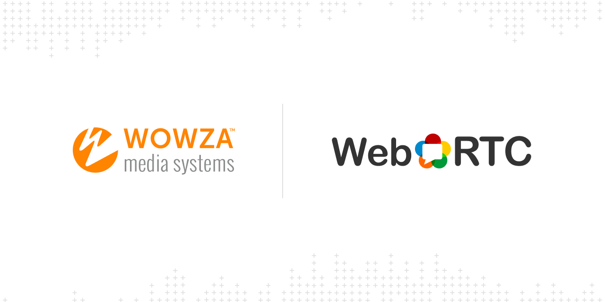

# Wowza Media Systems WebRTC client examples

Welcome to the official Wowza Media Systems Web Real-time Communication (WebRTC) client examples. These examples are intended to help developers bring live streaming into their applications using WebRTC.

## Contents

- [About WebRTC](#about-webrtc)
- [Getting Started](#getting-started)
  - [Set up WebRTC](#set-up-webrtc)
  - [Directory Structure](#directory-structure)
  - [Run the example code](#run-the-example-code)
- [Resources](#more-resources)
- [Contact](#contact-us)
- [License](#license)

## About WebRTC
WebRTC is an open source project to enable real-time communication of audio, video, and data in web browsers and native apps. WebRTC is designed for peer-to-peer connections but includes fallbacks in case direct connections fail. Encryption is mandatory for WebRTC streams, so you must host the examples on a web server using SSL encryption.

## Getting started

### Set up WebRTC
You'll need to set up WebRTC for Wowza Streaming Engine to run the examples. For more information, see [Set up WebRTC streaming with Wowza Streaming Engine](https://www.wowza.com/docs/how-to-use-webrtc-with-wowza-streaming-engine).

### Directory structure

In the `src` folder, you'll find examples for jQuery and React:

- `jquery-example`
    - `css` and `images` - Assets used by the example HTML pages.
    - `lib` - JavaScript files for managing the WebRTC setup.
        - `AvMenu.js` - Controls the selected input for publishing and screen sharing.
        - `Settings.js` - Creates a set of configuration settings and copy functionality.
        - `SoundMeter.js` - Provides an audio meter.
        - `WowzaMungeSDP.js` - Generates an SDP for peer signaling.
        - `WowzaPeerConnectionPlay.js` - Manages the signaling process for playback.
        - `WowzaPeerConnectionPublish.js` - Manages the signaling process for publishing.
        - `WowzaWebRTCPlay.js` - Controls the playback state.
        - `WowzaWebRTCPublish.js` - Controls the publishing state.
    - `dev-view-publish.html` - Example HTML page that can publish a WebRTC stream to Wowza Streaming Engine with video, audio, and screen share input.
    - `dev-view-play.html` - Example HTML page that can play back a WebRTC stream from Wowza Streaming Engine.
    - `play.js` and `publish.js` - JavaScript files that use files imported from the `lib` folder to control the WebRTC setup for publishing and playing streams.
- `react-example`
    - `src`
        - `components` - React components for the composite, meeting, play, and publish examples.
            - `composite` - CSS and JavaScript files that use components imported from other files to control the setup for compositing a WebRTC stream with multiple video and audio tracks.
                - `Composite.js`
                - `CompositePublisher.js`
                - `Compositor.js`
            - `media`
                - `CompositorUserMedia.js`
            - `meeting` - JavaScript files that use components imported from other files to control the setup for publishing a WebRTC stream with multiple participants.
            - `play` -  JavaScript files that use components imported from other files to control the WebRTC setup for playing streams.
            - `publish` - JavaScript files that use components imported from other files to control the WebRTC setup for publishing streams.
        - `webrtc` - JavaScript files for managing the WebRTC setup.
            - `replaceAudioTrack.js`
            - `replaceVideoTrack.js`

### Run the example code

>	**Note:**
>   If you're not running the examples from `localhost`, an HTTPS connection is required for WebRTC to access local devices.

#### React

In the `react-example` directory, run the following command:
```bash
 $ npm start
 ```

#### jQuery

In the `jquery-example` directory, run the following command:
```bash
 $ npx serve
 ```

Go to `localhost:5000/src/` to view the examples.

## More resources

- [WebRTC workflows in Wowza Streaming Engine](https://www.wowza.com/docs/webrtc-workflows-in-wowza-streaming-engine)
- [Wowza Streaming Engine WebRTC Publish Example (CodePen)](https://codepen.io/team/wowza/pen/abNJqWV)
- [Wowza Streaming Engine WebRTC Player Example (CodePen)](https://codepen.io/team/wowza/pen/GRZrVrQ)

## Contact us

Wowza Media Systems™, LLC

Wowza Media Systems provides developers with a platform to create streaming applications and solutions. See the [Wowza Developer Portal](https://www.wowza.com/resources/developers) to learn more about our APIs and SDKs.

## License

This code is distributed under the [BSD 3-Clause License](LICENSE.txt).