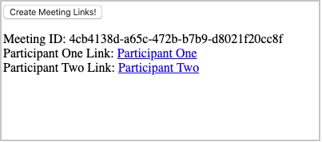
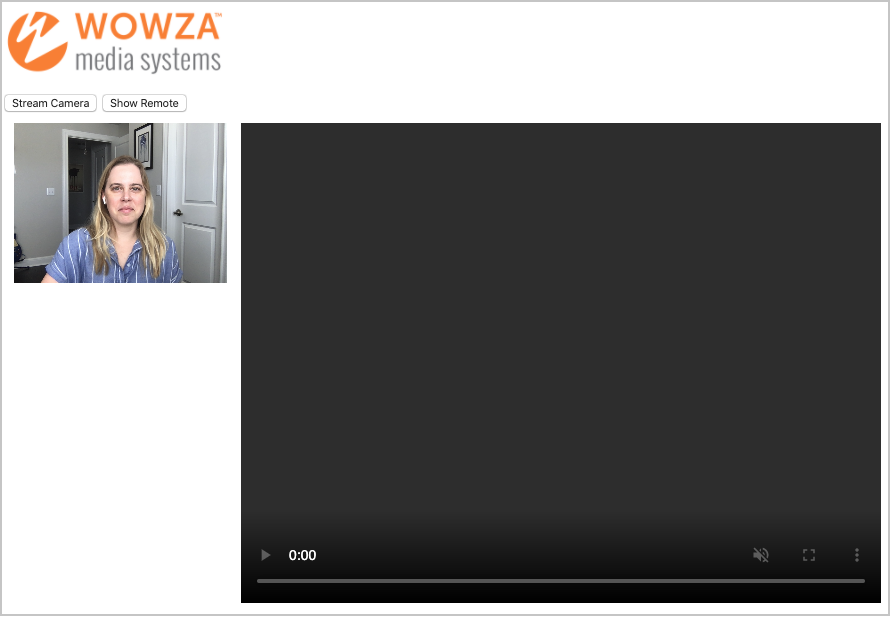

# Wowza Media Systems WebRTC client examples for one-to-one chat

Welcome to the official Wowza Media Systems WebRTC client examples. These examples are intended to help developers bring live streaming into their applications using WebRTC.

## Contents

- [Meeting](meeting/) The HTML, image, and Javascript files required for this example.
- [WebRTCChatMeeting.jar](lib/WebRTCChatMeeting.jar) - The HTTP Provider required to run this example.

>	**Important:**
>	* This example has been tested using Google Chrome and Wowza Streaming Engine.
>
>	* You must already have WebRTC configured and working with the basic examples provided. See [Set up WebRTC streaming with Wowza Streaming Engine](https://www.wowza.com/docs/how-to-use-webrtc-with-wowza-streaming-engine) for instructions on configuring WebRTC streaming with Wowza Streaming Engine.
>
>	* Encryption is mandatory for WebRTC streams, even when running these examples locally.

## Configure the WebRTCMeeting example with Wowza Streaming Engine

1. Download the `WebRTCChatMeeting.jar` file and copy it into **[wowza-install-directory]/lib/**.

2. In your **[wowza-install-directory]**, create a folder called **webrtcmeetingfiles**. This folder should be at the same level as your **[wowza-install-directory]/conf/** folder.

3. Download and copy the `meeting` files from this example into the newly created **[wowza-install-directory]/webrtcmeetingfiles** folder so you have **[wowza-install-directory]/webrtcmeetingfiles/meeting/<files>**.

4. In the **[wowza-install-directory]/webrtcmeetingfiles/meeting/** folder, open **meeting/js/webrtc-play.js** and **meeting/js/webrtc-publish.js**  and edit them to replace the `[YOUR CERT NAME HERE]` entry with the name of the SSL certificate you are using.

5. In the **[wowza-install-directory]/conf/** folder open the **VHost.xml** file and locate the <HostPort> container for port 443 with SSL.

	>	**Note:**  The default port for SSL is 443, however if you are using another port these same changes apply. 

6. The 443 host port with SSL container is commented out by default in **VHost.xml**. Comment it back in by removing the lines ```<!-- 443 with SSL -->```, ```<!--```, and ```-->``` from around the **<HostPort>** container.

7. Add the following HTTP Provider to your SSL **<HostPort>** container in your **VHost.xml** file just above the **HTTPServerVersion**, and then restart Wowza Streaming Engine.

	```
		<HTTPProvider>
			<BaseClass>com.wowza.webrtc.meeting.test.CreateChat</BaseClass>
			<RequestFilters>meeting*</RequestFilters>
			<AuthenticationMethod>none</AuthenticationMethod>
		</HTTPProvider>
	```

## Create a meeting

When creating a meeting, you'll need to generate a link for each participant in the meeting by doing the following. 

1. Go to your SSL hostname, such as `https://localhost.streamlock.net/meeting/createMeeting.html`.


2. Click **Create Links** to generate a meeting ID and unique links for each participant in the meeting.



3. Share the generated links with the meeting participants.

## Join a meeting

To join a meeting, each participant must do the following.

1. Go to the unique link provided by the meeting host.

2. When prompted, accept the browser request for access to your webcam and microphone. Access to both is required for this example. If webcam and microphone access have been disabled in the browser settings, you'll need to modify your settings to successfully run the example.

3. On the page the link takes you to, click **Stream Camera** to share your webcam stream, and then click **Show Remote** to access the other participants' streams.



4. You should now be able to chat with each other using a basic WebRTC demo.

## Altering the basic HTML files

- You can alter the provided files as needed for each part of this example.

- The HTTP provider can be set to any authentication level. By default, no authentication is required for this example. However, in your own implementation you could configure the HTTP provider authentication method as a way to control which users can create meetings.

- This example doesn't provided any authentication of streams. Further implementation would be required to support stream authentication.
